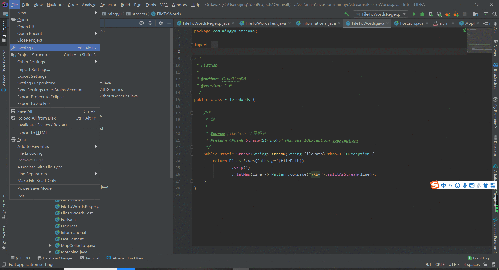

### 一、安装插件

> ##### 手动安装：
>
> ```
> File--->Setttings--->Plugins--->Install from disk--->选择CodeFlutter-1.0.1-RELEASE.zip
> ```
>
> 

> ##### 说明文档：
> ``` 说明文档：
> 1. 安装完毕后重启生效。
> 2. 版本更新时不会覆盖现有模板。
> 3. 不要解压zip包，安装时直接选zip包即可。
> ```

