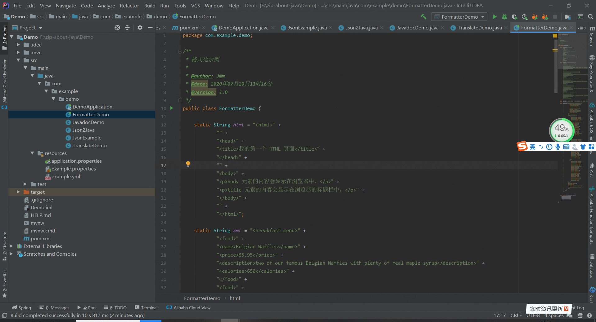
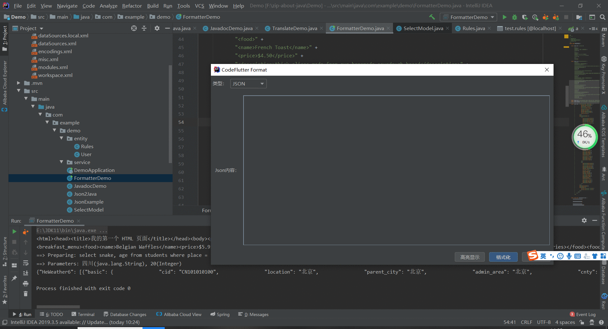
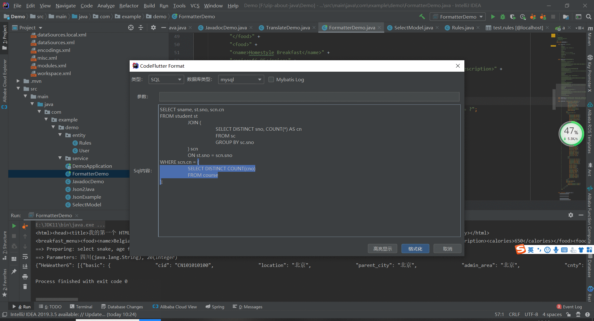

### 一、普通格式化

> ##### 动图教程
>
> 
>
>
>


### 二、SQL格式化

> ##### 动图教程
>
> 1.无占位符
>
> 
>
> 2.带占位符
>
> 
>

### 三、注意事项
>
> ```注意事项
> 1. 插件格式化功能提供格式化（可编辑）及高亮显示（不可编辑）
> 2. 主窗口编辑器格式化目前支持json、html、xml、sql四种语言
> 3. sql格式化操作，参数占位符请使用"?"
> ```