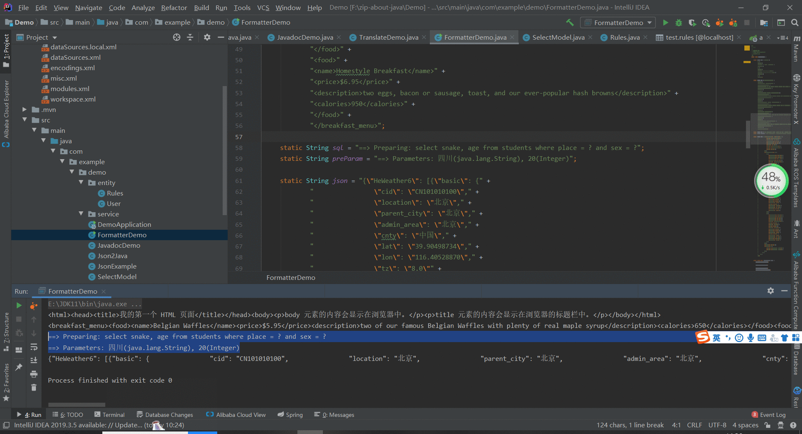

### 一、Json格式化

> ##### 动图教程
>
> 
>
> ##### 说明文档：
>
> ``` 说明文档：
> 1. json格式化与普通编辑器主窗口格式化操作无异
> 2. 可以在格式化后的对话框面板中编辑，改变想要格式化的json内容
> 3. 高亮显示无法编辑
> ```

### 二、SQL格式化

>##### 动图教程
>
>
>
>##### 说明文档
>
>```说明文档
>1. 控制台窗口的格式化提供mybatis日志自动参数补全功能，日志输出格式有要求：
>   1）如含有关键字Preparing、Parameters中之一或全部或无关键字的正常sql语句
>   2）不支持多条语句
>2. 也支持非mybatislog的控制台输出sql语句格式化，操作方式参见'普通格式化'章节
>3. 对话框面板支持编辑，高亮显示不支持编辑
>```
>
>