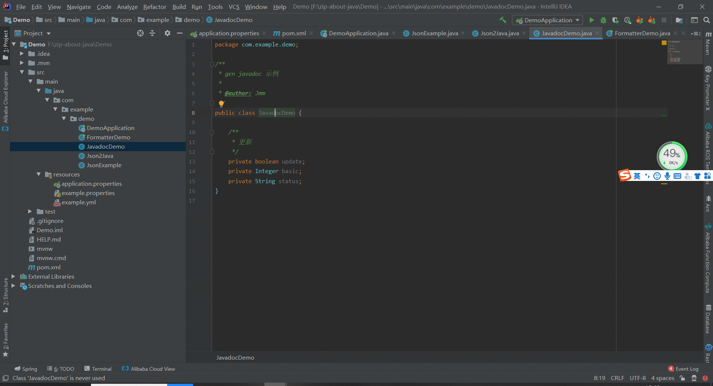
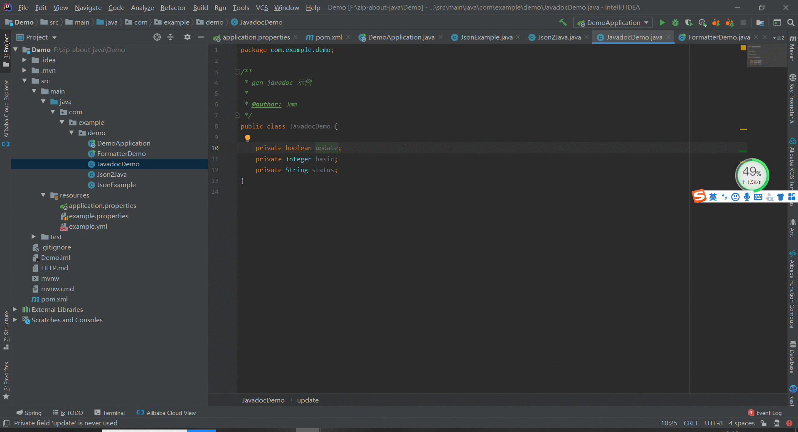
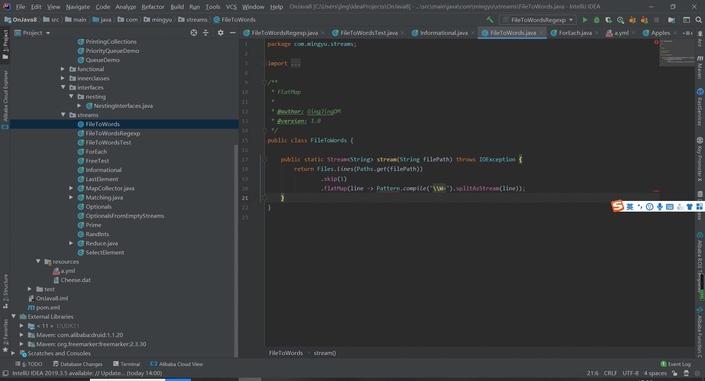

### 一、Note 

<font color='red' style='bold'>1.生成的是java本身的doc文档注释</font>

<font color='red' style='bold'>2.后续可能会增加生成接口api文档功能，当然时间紧就算了</font>

### 二、类

> ##### 动图教程
>
> 
>
> ##### 说明文档
>
> ``` 说明文档
> 1. 选择鼠标移动至类名，右键【CodeFlutter】的【Code Doc】的【Gen AllDoc】/【JavaDoc】
> 2. 勾选存在的相应（类、属性、方法、字段）的选项
> ```

#### 三、字段

> ##### 动图教程：
> 
> ##### 说明文档：
> ``` 说明文档：
> 1. 选择鼠标移动至属性名，右键【CodeFlutter】的【Code Doc】的【JavaDoc】
> ```

### 四、方法

>##### 动图教程
>
>
>
>##### 说明文档
>
>``` 说明文档
>1. 选择鼠标移动至方法名，右键【CodeFlutter】的【Code Doc】的【JavaDoc】
>```