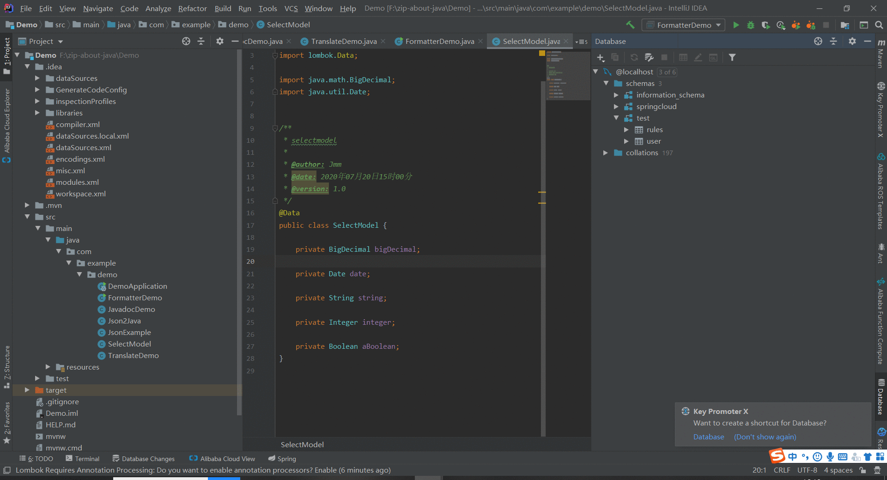
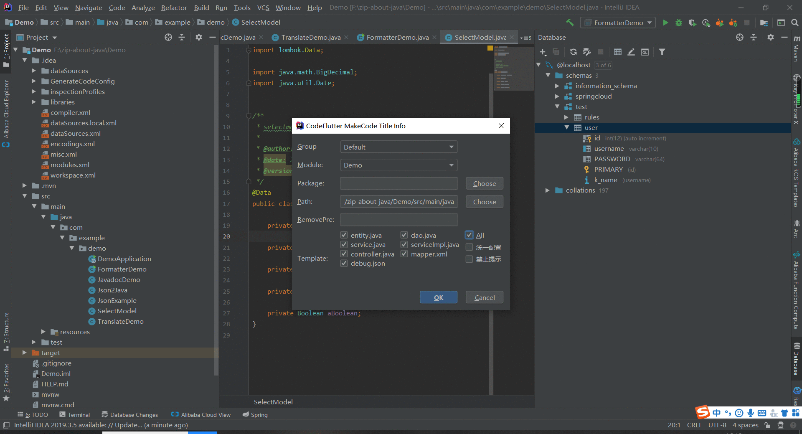
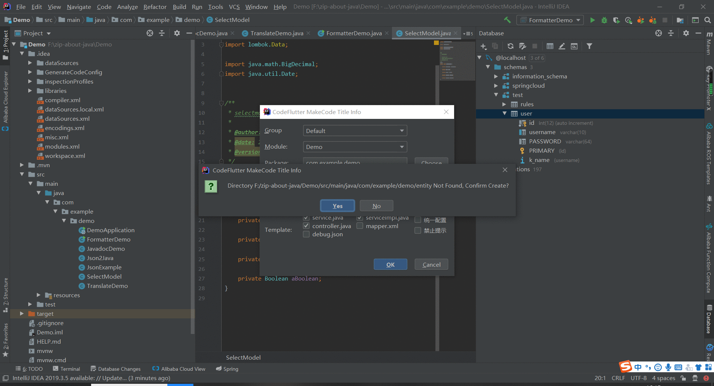
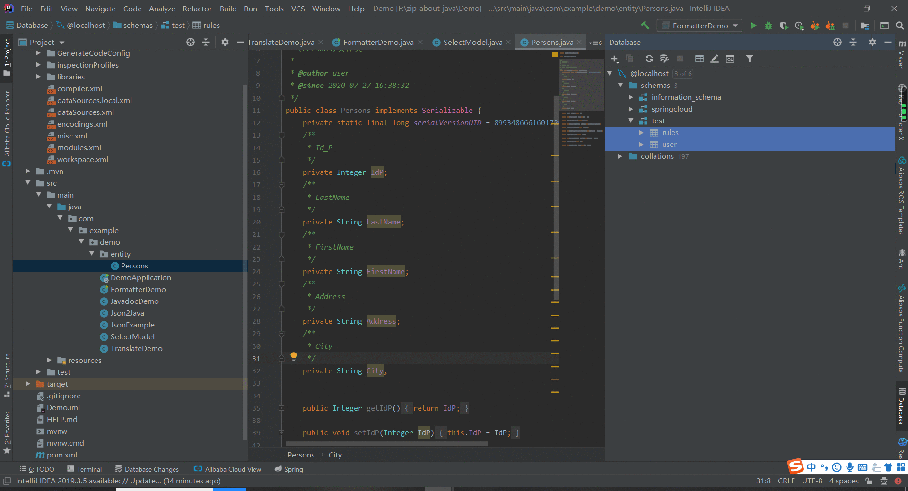
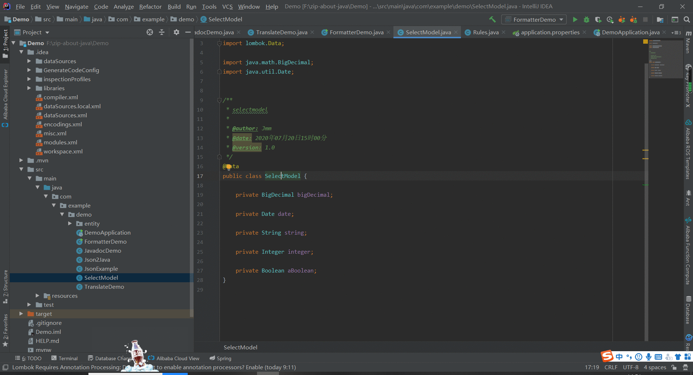
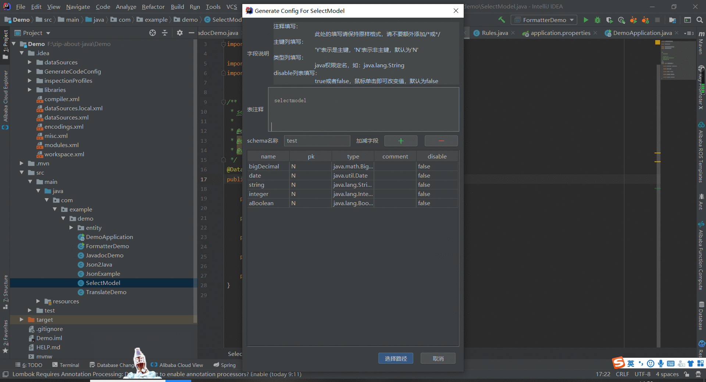
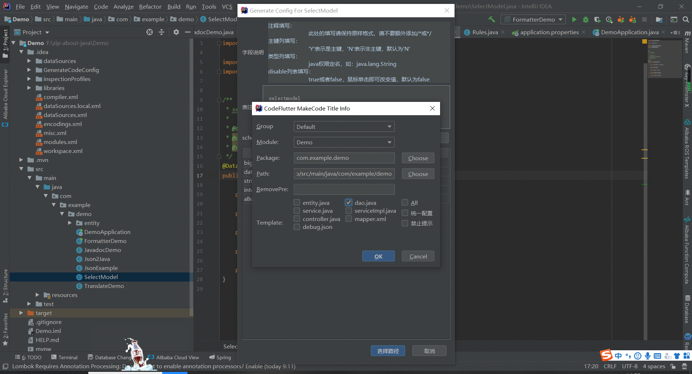
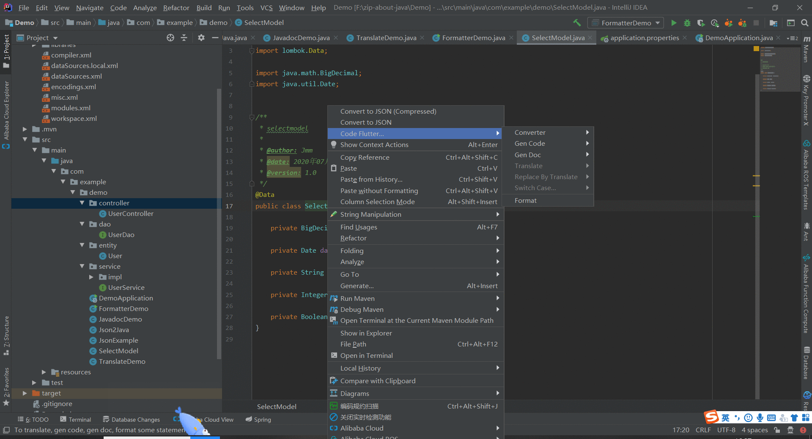
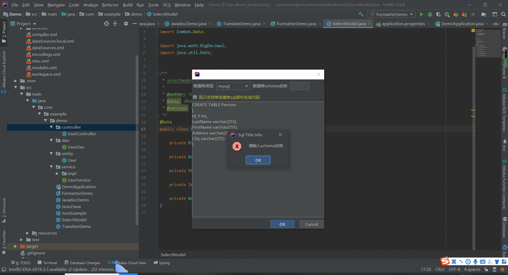
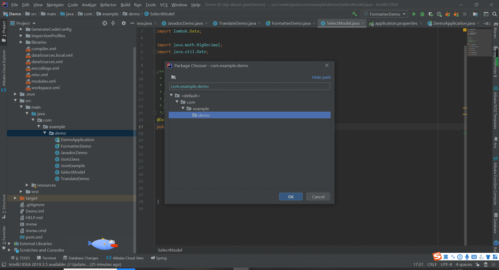

### 一、单表生成
> ##### 动图教程：
> 
>
>
>
> 
>
>
>
> 
>
> ##### 说明文档：
> ``` 说明文档：
> 1. 每张表生成一次代码后，配置信息将会被保存，方便下次生成。
> 2. 禁止提示表示所有对话框不再弹出，并自动确认。
> 3. 多module项目，注意需要先选择module。
> 4. 统一配置（emmmm...）后面会介绍。
> ```


### 二、多表生成
> ##### 动图教程
> 
> ##### 说明文档：
> ``` 说明文档：
> 1. 可以通过按住ctrl键去选中多张表，或者通过shift方式。
> 2. 默认使用最先被选中的表的配置信息。
> ```

### 三、选择Java实体类生成

> ##### 动图教程
>
> 
>
>
>
> 
>
>
>
> 
>
> ##### 说明文档
>
> ``` 说明文档
> 1. 请按照弹出框规范填写相关信息
> 2. 暂时支持单个javabean实体生成
> 3. 请确认信息配置对话框信息，可以进行编辑、增加或减少字段
> 4. 若想预览效果请在模板设置面板调试方式后面debug会说明
> 5. 注意由于此插件不会将实体直接映射回数据库，故增加减少的字段不会影响数据库字段
> ```

### 四、建表语句生成

>##### 动图教程
>
>
>
>
>
>
>
>
>
>
>
>##### 说明文档
>
>``` 说明文档
>1. 由建表语句生成的方式依赖于对sql语句的解析，可能存在无法解析或者解析不准确的情况，请尽量不要输入过于复杂的建表语句
>2. 暂时只支持单条建表语句的生成方式
>3. 请确认信息配置对话框信息，可以进行编辑、增加或减少字段
>4. 注意由于此插件不会将实体直接映射回数据库，故增加减少的字段不会影响数据库字段
>```

