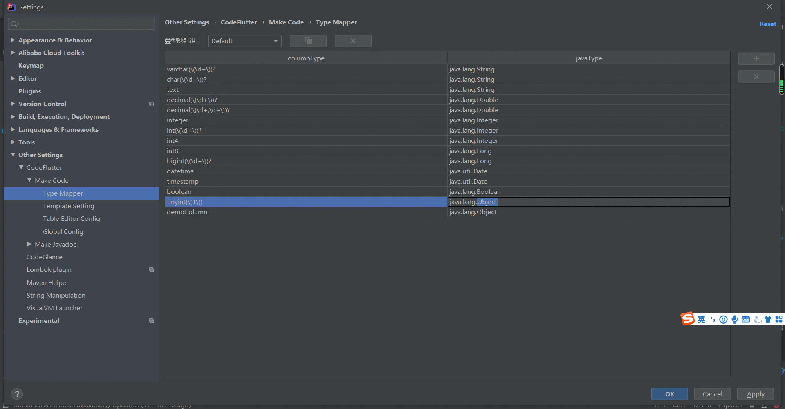
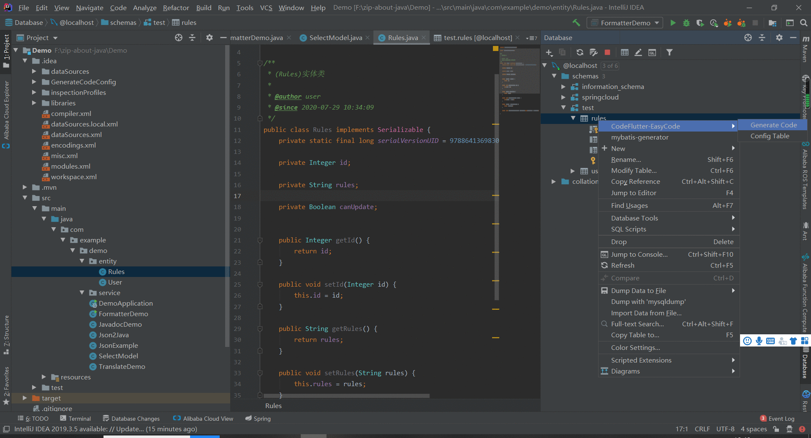

### 如何添加类型映射？
> ##### 动图教程：
> 
>
> 
>
> 
>
> ##### 说明文档：
> ``` 说明文档：
> 1. 默认只有一部分类型映射，其他的需要用户自行添加。
> 2. 类型映射统一使用正则表达式实现。
> 3. 不需要使用Java编码时的\\转义符，直接使用\即可。
> ```
> ##### 实例：
> 表达式|可匹配项|可匹配项|可匹配项|可匹配项|不可匹配项目
> ---|---|---|---|---|---
> `int\(\d+\)`|int(1)|int(2)|int(10)|int(99999)|int
> `int(\(\d+\))?`|int|int(1)|int(10)|int(99999)|
> `decimal\(\d+,\d+\)`|decimal(1,1)|decimal(10,10)|decimal(100,100)|decimal(10,1)|decimal(1)
> `decimal\(\d+(,\d+)?\)`|decimal(1,1)|decimal(10)|decimal(100,100)|decimal(10)|decimal
> `tinyint\(1\)`|tinyint(1)||||
> `int\([1-8]\)`|int(1)|int(2)|int(3)|int(8)|int(9)
> `int\((9|\d{2,})\)`|int(9)|int(10)|int(123)|int(999)|int(6)
> ##### 相关链接
> [Java正则表达式](http://www.runoob.com/java/java-regular-expressions.html)