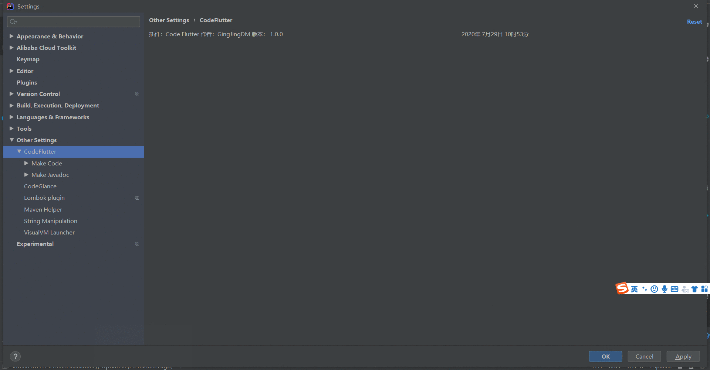
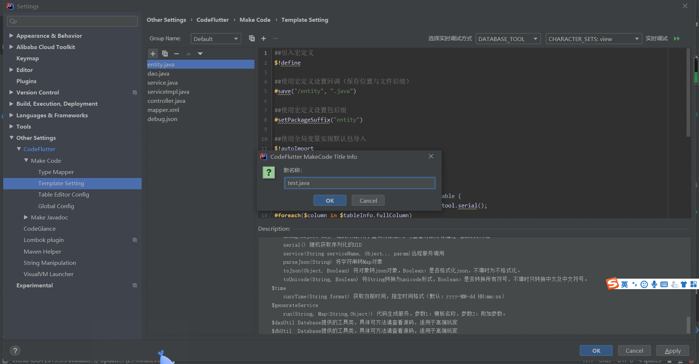
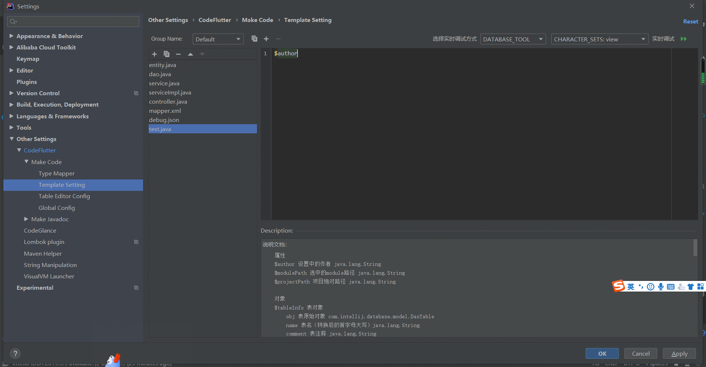

### 自定义模板
> ##### 动图教程：
> 
>
> 
>
> 
>
> ##### 说明文档：
> ``` 说明文档：
> 1. 编写模板时下面配有说明文档，注意查看。
> 2. 编写时可以实时调式。
> 3. 不推荐编辑默认模板，可以复制一个分组进行编辑。（点击分组右边的复制图标或新增图片）
> 4. 添加模板时名称尽量带扩展名，如entity.java 这样可以实现代码语法高亮。
> ```
> ##### 相关链接：
> 1. [官网英文文档](http://velocity.apache.org/engine/1.7/user-guide.html)
> 2. [Velocity模板引擎语法](https://www.cnblogs.com/yangzhinian/p/4885973.html)