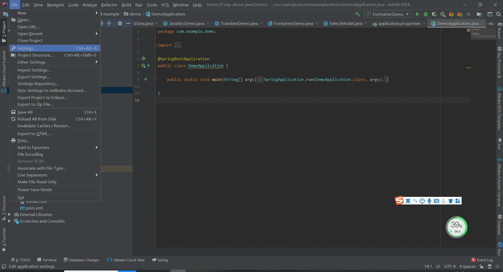
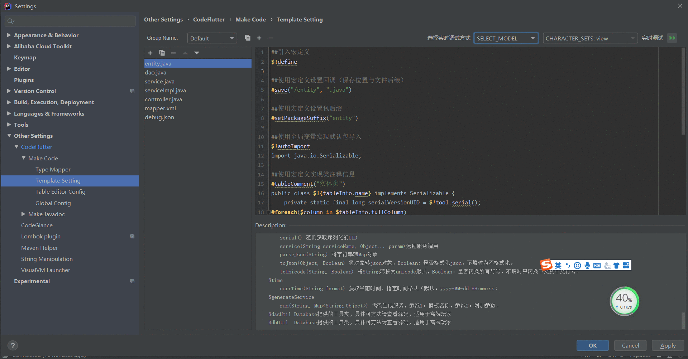

### 一、实时调试具体方式

> ##### 动图教程
>
> 
>
> ##### 说明文档
>
> ``` 说明文档
> 1. 调试内容可以通过将自定义的变量注释来查看效果
> 2. 详细的参数可以通过Description面板查看
> ```

### 二、database tool

> ##### 动图教程：
> 
> ##### 说明文档：
> ``` 说明文档：
> 1. 通过tool.debug方法可以调试任意对象。
> 2. 通过调试可以查看到对象的所有属性和所有public方法。
> 3. 通过tool.getField方法可以获取到对象任意属性，包括private属性。
> 4. 作用：不清楚内部结构的对象都可以通过debug功能来查询。
> ```

### 三、select java model

>##### 动图教程
>
>
>
>
>
>##### 说明文档
>
>``` 说明文档
> 1. 调试时若未为该类生成过代码，请选择否，然后生成一次代码后进行调试（有点鸡肋，在考虑后续删除这个步骤）
> 2. 请尽量使用database tool模式进行调试
>```
>