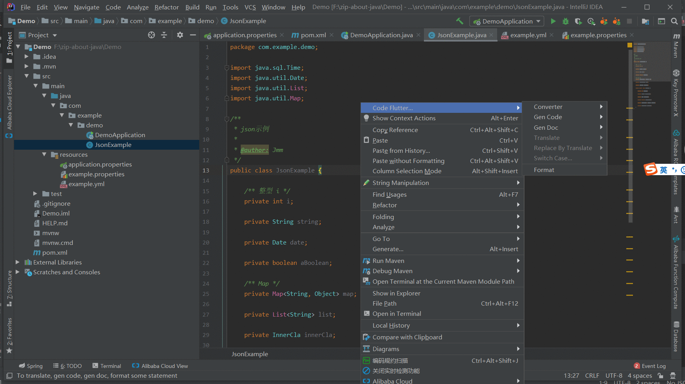
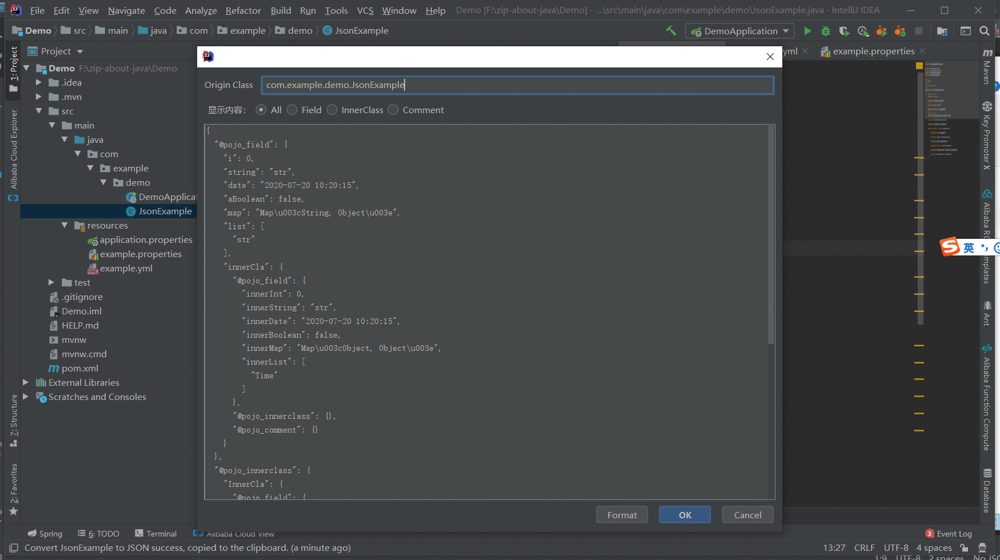

### 一、Show In Dialog

> ##### 动图教程
>
> 
>
> ##### 说明文档
>
> ``` 说明文档
> 1. 选择“是”直接生成此类的json字符串
> 2. 选择“否”可以再次选择java类进行生成
> 3. 提供【all】、【field】、【innerclass】、【comment】选项，即相应显示：“所有”、“属性字段”、“内部类”、“注释”的json字符串，默认为【field】
> ```

#### 二、Direct 2 Clipboard

> ##### 动图教程：
> 
> ##### 说明文档：
> ``` 说明文档：
> 1. 右键点击java 2 json菜单后，默认同时复制至粘贴板，可以在其他地方直接粘贴
> ```
