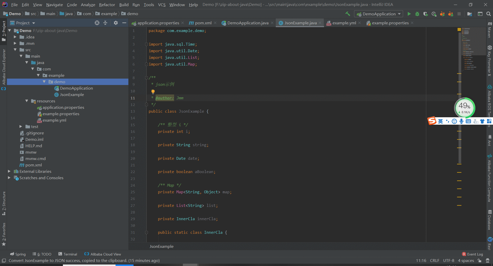

### 一、Json 2 java

> ##### 动图教程
>
> 
>
> ##### 说明文档
>
> ``` 说明文档
> 1. 方式一：左侧【project】选择生成javabean的路径所在的文件夹，右键选择【new】的【Java Class From Json】
>    方式二：选择生成javabean的路径所在的文件夹下的任意java类，右键选择【CodeFlutter】选择【Converter】的json2java
> 2. 可以通过点击【设置】进行全局设置，比如是否生成某些注解等
> 3. 点击【确认】后可以再次对字段属性进行编辑
> 4. 若使用左侧new class from json菜单将json转换为java类，当输入的json字段为空时会默认删除将要生成的javabean，即该方式不支持生成空属性java类
> ```
