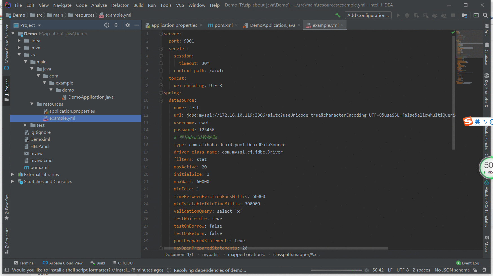

### 一、Yml 2 Properties

> ##### 动图教程
>
> 
>
> ##### 说明文档
>
> ``` 说明文档
> 1. 方式一：可以在左侧【project】栏选择yaml（yml）文件，右键弹出【Yaml Properties Converter】菜单
>    方式二：可以通过在中间的【editor】编辑器窗口（必须为yml文件）选择【CodeFlutter】的【Converter】的【Yaml Properties Converter】菜单
> 2. 会在同目录下生成同名的properties文件，并保留原yml
> 3. 无法转换yml文件中的注释（若有时间且迫切需要会再尝试添加此功能，初次尝试是失败了的）
> ```

