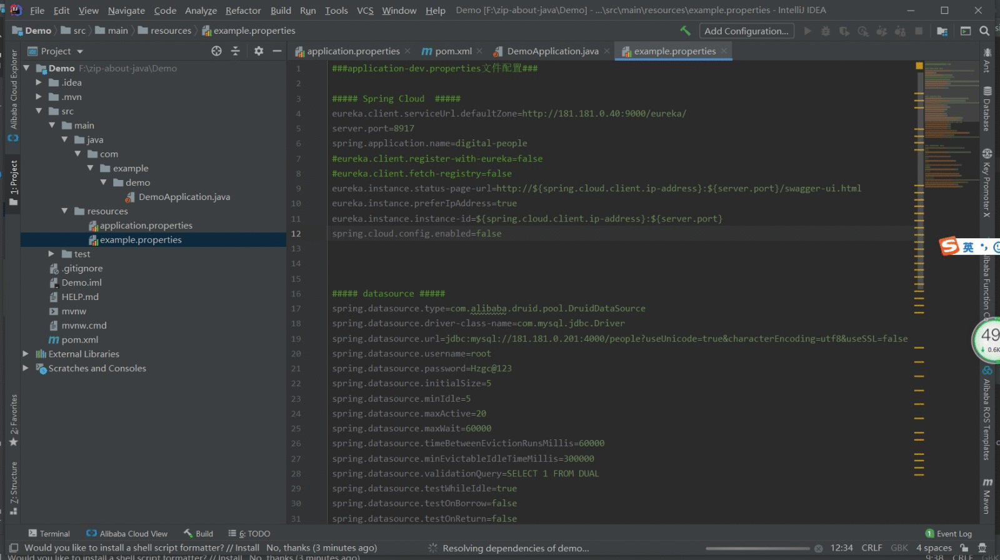

### 一、Properties 2 Yml

> ##### 动图教程
>
> 
>
> ##### 说明文档
>
> ``` 说明文档
> 1. 方式一：可以在左侧【project】栏选择properties文件，右键弹出【Yaml Properties Converter】菜单
>    方式二：可以通过在中间的【editor】编辑器窗口（必须为properties文件）选择【CodeFlutter】的【Converter】的【Yaml Properties Converter】菜单
> 2. 会在同一目录下生产同名的yml文件，并保留原properties文件
> 3. 无法转换properties文件的注释（若有时间且迫切需要会再尝试添加此功能，初次尝试是失败了的）
> ```

